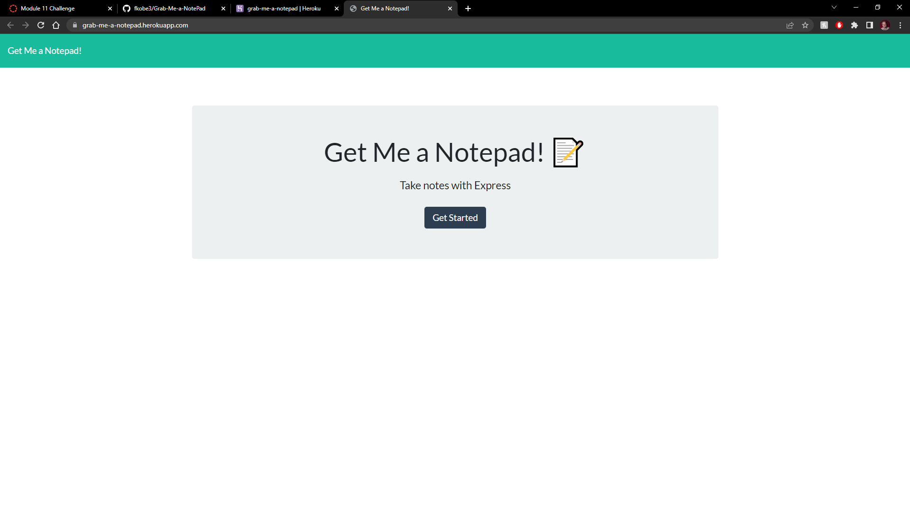
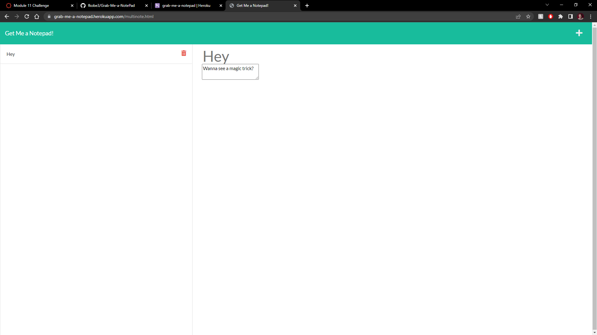
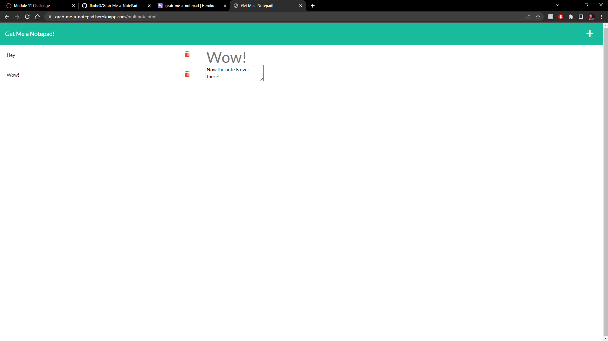

  # Grab Me a Notepad!
  
  ## Licensing: 
  

## Description
This program allows you to create a README based off of answers to inputs that you put in. No longer will you need to create the README yourself, but with just a few questions answers, one is already created for you, with it setup to show the different sections in a classic format.
## Table of Contents
+ [Installation](#installation)
+ [Usage](#usage)
+ [Screenshots](#screenshots)
+ [Contributing](#contributing)
+ [Testing](#testing)

## Installation
  One  simply goes to Heroku to open the application, although if one wants to do this locally, they would want to make sure to copy the code, downloading node, and express specifically to allow it to run.

## Usage
  Examples of use would be primarly whenever you do not have a piece of paper and a pen or pencil, you can create a note easily with this application, and when you no longer need the reminder, deleting it is as easy as a button press
## Screenshots 

## Contributing
  Base source code was retrieved from Xander Rapstine (Xandromus) and John McCambridge (nol166) on GitHub.

## Testing
 For testing make sure to use github command (npm start) to create local server on machine if done locally, otherwise one can test with active application on Heroku  https://grab-me-a-notepad.herokuapp.com/ 
  
## Questions:
If you have any questions on the program, please contact me at Github, my name is fkobe3, or via email at fkobe3@gmail.com.